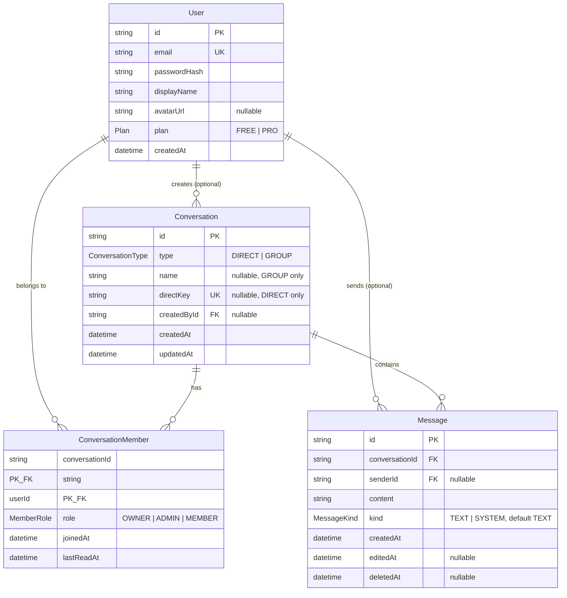

# Modèle de données

Schéma défini dans `server/prisma/schema.prisma`, appliqué par les migrations
`init_mvp` puis `add_message_kind` (Etape 4). Ce document sert de source pour
le chapitre UML du rapport.

## Diagramme entité-relation

## Décisions à justifier à l'oral

- **`directKey`** : pour une conversation `DIRECT`, on stocke
  `"<idUtilisateurLePlusPetit>:<idUtilisateurLePlusGrand>"` (tri lexicographique
  des deux `id`). La contrainte `@unique` empêche, **au niveau de la base**,
  que deux utilisateurs ouvrent deux DM différents en même temps (race
  condition évitée sans verrou applicatif). Les conversations `GROUP` laissent
  `directKey` à `null` — Postgres autorise plusieurs `NULL` dans un index
  unique, donc ça ne bloque pas la création de plusieurs groupes.
- **`ConversationMember`** est une table pivot *avec charge utile* (`role`,
  `joinedAt`, `lastReadAt`), pas une simple table de jointure : c'est ce qui
  permet de calculer les messages non lus (`Message.createdAt > lastReadAt`)
  et de gérer les rôles par conversation.
- **Suppression en cascade vs `SetNull`** : supprimer une `Conversation`
  supprime ses `ConversationMember` et `Message` (`onDelete: Cascade`) — ils
  n'ont pas de sens sans leur conversation. Supprimer un `User` ne supprime
  pas l'historique : `Conversation.createdById` et `Message.senderId` passent
  à `null` (`onDelete: SetNull`), donc `createdById` et `senderId` doivent
  rester optionnels — on garde la trace des messages même après suppression
  du compte (ex. RGPD : anonymisation plutôt que perte d'historique).
- **`@@index([conversationId, createdAt])`** sur `Message` : la requête la
  plus fréquente de l'app est "messages d'une conversation, triés par date,
  paginés" — sans cet index c'est un scan complet de la table à chaque
  ouverture de conversation.
- **`Message.kind`** (Etape 4) : distingue un message écrit par un utilisateur
  (`TEXT`) d'une entrée générée par une mutation de groupe — ajout/retrait de
  membre, changement de rôle, renommage, etc. (`SYSTEM`). Les deux ont
  `senderId = null` dans certains cas (un `SYSTEM` toujours, un `TEXT` si
  l'auteur a supprimé son compte) donc `senderId` seul ne suffit pas à les
  distinguer côté client. `@default(TEXT)` pour que la migration ne touche
  pas les lignes existantes.
