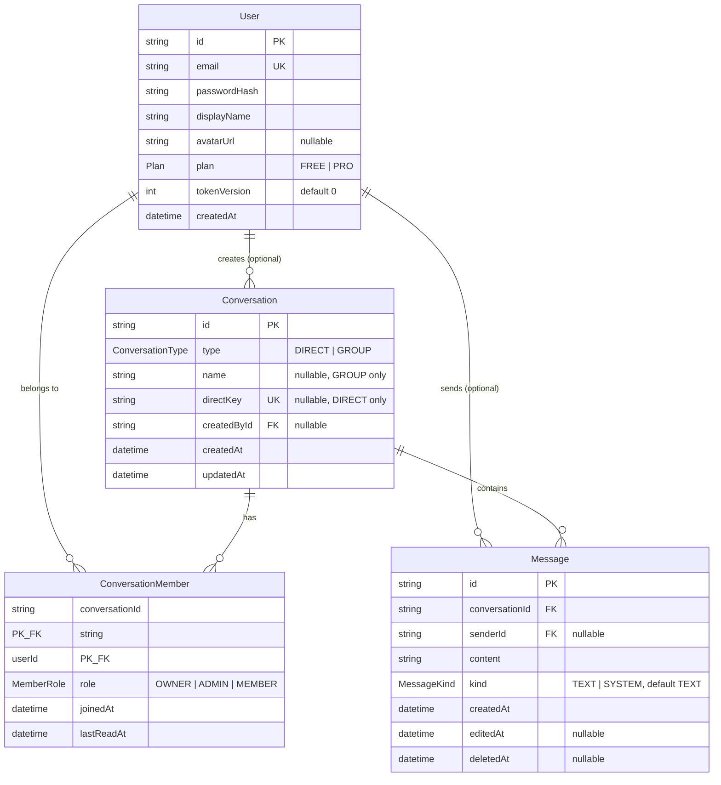

# Modèle de données

Schéma défini dans `server/prisma/schema.prisma`, appliqué par les migrations
`init_mvp`, `add_message_kind` (Etape 4) puis `add_user_token_version`
(paramètres du compte). Ce document sert de source pour
le chapitre UML du rapport.

## Diagramme entité-relation

```mermaid
erDiagram
    User ||--o{ Conversation : "creates (optional)"
    User ||--o{ ConversationMember : "belongs to"
    User ||--o{ Message : "sends (optional)"
    Conversation ||--o{ ConversationMember : "has"
    Conversation ||--o{ Message : "contains"

    User {
        string id PK
        string email UK
        string passwordHash
        string displayName
        string avatarUrl "nullable"
        Plan plan "FREE | PRO"
        int tokenVersion "default 0"
        datetime createdAt
    }

    Conversation {
        string id PK
        ConversationType type "DIRECT | GROUP"
        string name "nullable, GROUP only"
        string directKey UK "nullable, DIRECT only"
        string createdById FK "nullable"
        datetime createdAt
        datetime updatedAt
    }

    ConversationMember {
        string conversationId PK_FK
        string userId PK_FK
        MemberRole role "OWNER | ADMIN | MEMBER"
        datetime joinedAt
        datetime lastReadAt
    }

    Message {
        string id PK
        string conversationId FK
        string senderId FK "nullable"
        string content
        MessageKind kind "TEXT | SYSTEM, default TEXT"
        datetime createdAt
        datetime editedAt "nullable"
        datetime deletedAt "nullable"
    }
```

## Décisions à justifier à l'oral

- **`directKey`** : pour une conversation `DIRECT`, on stocke
  `"<idUtilisateurLePlusPetit>:<idUtilisateurLePlusGrand>"` (tri lexicographique
  des deux `id`). La contrainte `@unique` empêche, **au niveau de la base**,
  que deux utilisateurs ouvrent deux DM différents en même temps (race
  condition évitée sans verrou applicatif). Les conversations `GROUP` laissent
  `directKey` à `null` — Postgres autorise plusieurs `NULL` dans un index
  unique, donc ça ne bloque pas la création de plusieurs groupes.
- **`ConversationMember`** est une table pivot *avec charge utile* (`role`,
  `joinedAt`, `lastReadAt`), pas une simple table de jointure : c'est ce qui
  permet de calculer les messages non lus (`Message.createdAt > lastReadAt`)
  et de gérer les rôles par conversation.
- **Suppression en cascade vs `SetNull`** : supprimer une `Conversation`
  supprime ses `ConversationMember` et `Message` (`onDelete: Cascade`) — ils
  n'ont pas de sens sans leur conversation. Supprimer un `User` ne supprime
  pas l'historique : `Conversation.createdById` et `Message.senderId` passent
  à `null` (`onDelete: SetNull`), donc `createdById` et `senderId` doivent
  rester optionnels — on garde la trace des messages même après suppression
  du compte (ex. RGPD : anonymisation plutôt que perte d'historique).
- **`@@index([conversationId, createdAt])`** sur `Message` : la requête la
  plus fréquente de l'app est "messages d'une conversation, triés par date,
  paginés" — sans cet index c'est un scan complet de la table à chaque
  ouverture de conversation.
- **`Message.kind`** (Etape 4) : distingue un message écrit par un utilisateur
  (`TEXT`) d'une entrée générée par une mutation de groupe — ajout/retrait de
  membre, changement de rôle, renommage, etc. (`SYSTEM`). Les deux ont
  `senderId = null` dans certains cas (un `SYSTEM` toujours, un `TEXT` si
  l'auteur a supprimé son compte) donc `senderId` seul ne suffit pas à les
  distinguer côté client. `@default(TEXT)` pour que la migration ne touche
  pas les lignes existantes.
- **`User.tokenVersion`** (paramètres du compte) : copié dans chaque JWT de
  session et comparé à la base à chaque requête/handshake
  (`authenticateToken` dans `lib/session.js`). Un changement de mot de passe
  l'incrémente, ce qui invalide d'un coup toutes les sessions émises avant —
  un JWT seul, sans état serveur, ne sait pas faire ça. La même requête
  (lookup par clé primaire) rejette aussi un token dont l'utilisateur a été
  supprimé. `avatarUrl` reste inutilisé : l'avatar est généré côté client à
  partir des initiales (aucun stockage de fichier).

## Suppression d'un compte — ce qui se passe exactement

`DELETE /api/account` (mot de passe re-vérifié), dans **une seule
transaction** (`deleteAccount` → `departAllConversations`) :

1. Pour chaque conversation de l'utilisateur, le même chemin que « quitter »
   (`departConversation`, partagé avec leave / transfert) :
   - dernier membre → la conversation est supprimée (cascade sur ses messages) ;
   - `GROUP` dont il était `OWNER` → la propriété passe à l'`ADMIN` le plus
     ancien (`joinedAt`), sinon au membre le plus ancien
     (`pickSuccessorOwner`), message `SYSTEM` « X a supprimé son compte, Y est
     maintenant propriétaire » ;
   - sinon (`GROUP` ou `DIRECT`) → message `SYSTEM` « X a supprimé son compte ».
2. `User` supprimé : ses `ConversationMember` restants partent en cascade,
   ses `Message` gardent leur contenu avec `senderId = null` (affiché
   « Utilisateur supprimé »), `createdById` passe à `null`.
3. Un `DIRECT` survit donc avec **un seul membre** : historique intact, mais
   `canPostMessage` refuse l'envoi (`RECIPIENT_GONE`) et le DTO expose
   `recipientGone: true` pour que le client désactive le champ de saisie.
   `directKey` garde l'ancien id — sans conséquence, un id cuid n'est jamais
   réattribué.

Après le commit : événements socket aux membres restants (`presence:update`
hors ligne, `member:role_changed`, `member:removed`, message `SYSTEM`), puis
`disconnectSockets` sur `user:<id>`, et le cookie est effacé.

**Limite connue (assumée pour cette étape) :** changer son `displayName`
re-signe son propre cookie, mais n'est pas diffusé en temps réel. Les autres
clients voient l'ancien nom dans la barre latérale et la liste des membres
jusqu'à leur prochain refetch (les messages, eux, relisent le nom en base à
chaque chargement). Un événement `user:updated` vers les rooms des
conversations de l'utilisateur corrigerait ça.
